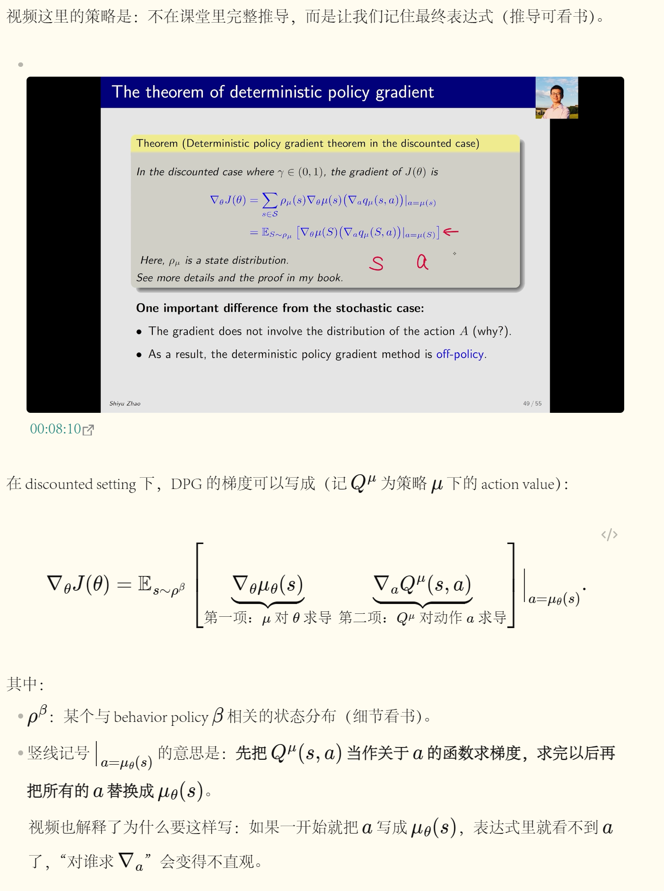
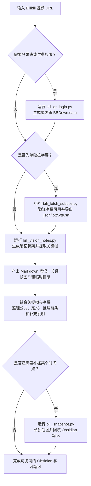

# bilibili-obsidian-notes

把 B 站视频转换成可复习的 Obsidian 学习笔记：拉字幕、提取关键帧、在关键位置截图，并辅助整理公式、定义、推导链条与补充说明。

*Turn Bilibili videos into Obsidian study notes with subtitle download, keyframe capture, targeted screenshots, and structured explanations for formulas, slides, and lecture content.*



> 说明：本仓库只提供工具与流程，不包含任何受版权保护的视频/字幕内容。请自行确保符合平台条款与版权要求。
>
> 致谢：本仓库中的 B 站字幕拉取能力与 `BBDown.data` 兼容设计参考并受益于开源项目 [BBDown](https://github.com/nilaoda/BBDown) 的工程实践；当前仓库不依赖 `BBDown` 可执行文件，感谢其对社区的持续贡献。

## 适用场景

- 把课程、讲座、公开视频整理成可回看的 Obsidian 学习笔记
- 从字幕和关键帧里提取公式、板书、图表、伪代码与核心结论
- 在关键时间点截图，补充定义、推导说明、易错点与上下文解释
- 只拉字幕做离线复用，或只做截图定位某个时间点的内容

## 工作流总览



完整文字版说明见 `docs/workflow.md`。

## 安装（Windows / PowerShell）

当前 skill 的公开名称和 GitHub 仓库名都已经统一为 `bilibili-obsidian-notes`。

如果你是通过 Skills CLI 安装到 Codex，优先使用：

```powershell
npx skills add le876/bilibili-obsidian-notes
```

安装完成后重启 Codex，使新 skill 生效。

如果你的环境更偏向显式 GitHub URL，也可以使用：

```powershell
npx skills add https://github.com/le876/bilibili-obsidian-notes
```

如果你想直接克隆仓库、单独运行脚本或做二次开发，也可以手动放到你的 skills 目录：

```powershell
git clone https://github.com/le876/bilibili-obsidian-notes.git `
  "$env:USERPROFILE\.codex\skills\bilibili-obsidian-notes"
```

直接运行脚本时，先安装依赖：

```powershell
python -m venv .venv
.\.venv\Scripts\Activate.ps1
pip install -r requirements.txt
# 可选：从浏览器读取 cookies（登录态更稳）
pip install -r requirements-optional.txt
```

## 快速上手

推荐主流程是：扫码登录（按需） -> 生成笔记骨架 + 关键帧 -> 再按需要单独拉字幕或补截图。

### 1) 生成 Obsidian 笔记骨架 + 关键帧

```powershell
python -X utf8 scripts\bili_vision_notes.py `
  --url "<Bilibili URL>" `
  --vault "<你的 Obsidian Vault 路径>" `
  --max-frames 12
```

如果视频需要登录态或付费权限，可以在执行前先扫码登录，或在相关命令里加 `--login`。

### 2) 扫码登录（按需）

```powershell
python -X utf8 scripts\bili_qr_login.py
```

默认写入：`%USERPROFILE%\.codex\cache\bili-vision-notes\BBDown.data`

### 3) 单独拉字幕（按需）

```powershell
python -X utf8 scripts\bili_fetch_subtitle.py `
  --url "<Bilibili URL>" `
  --out ".\\subtitle.json" `
  --login
```

输出后缀决定格式：`.json/.txt/.vtt/.srt`

### 4) 单独截图（按需）

```powershell
python -X utf8 scripts\bili_snapshot.py `
  --url "https://www.bilibili.com/video/<BV>/?t=501.16#t=08:21.17" `
  --vault "<你的 Obsidian Vault 路径>"
```

## 选择合适入口

- `bili_vision_notes.py`：默认主入口。适合“从一个视频直接生成可整理的笔记骨架 + 关键帧”
- `bili_fetch_subtitle.py`：适合“我只想把字幕拉下来，后面自己处理”
- `bili_snapshot.py`：适合“我只想抓某个时间点的画面，回填到已有笔记里”
- `bili_qr_login.py`：适合“视频需要登录态，先生成或更新 `BBDown.data`”

## 输出内容

默认产物通常包括：

- 笔记：`<vault>/video-notes/<title> (<id>).md`
- 关键帧图片：`<vault>/video-notes-images/<id>/*.png`
- 临时目录：`<vault>/.tmp/bili-vision-notes/<id>/...`

如果你使用 `bili_snapshot.py` 单独截图，默认还会生成可直接嵌入 Obsidian 的图片链接或嵌入行。

## 更多说明

- 工作流说明：`docs/workflow.md`
- 常见问题：`docs/troubleshooting.md`
- Agent 使用说明：`SKILL.md`
